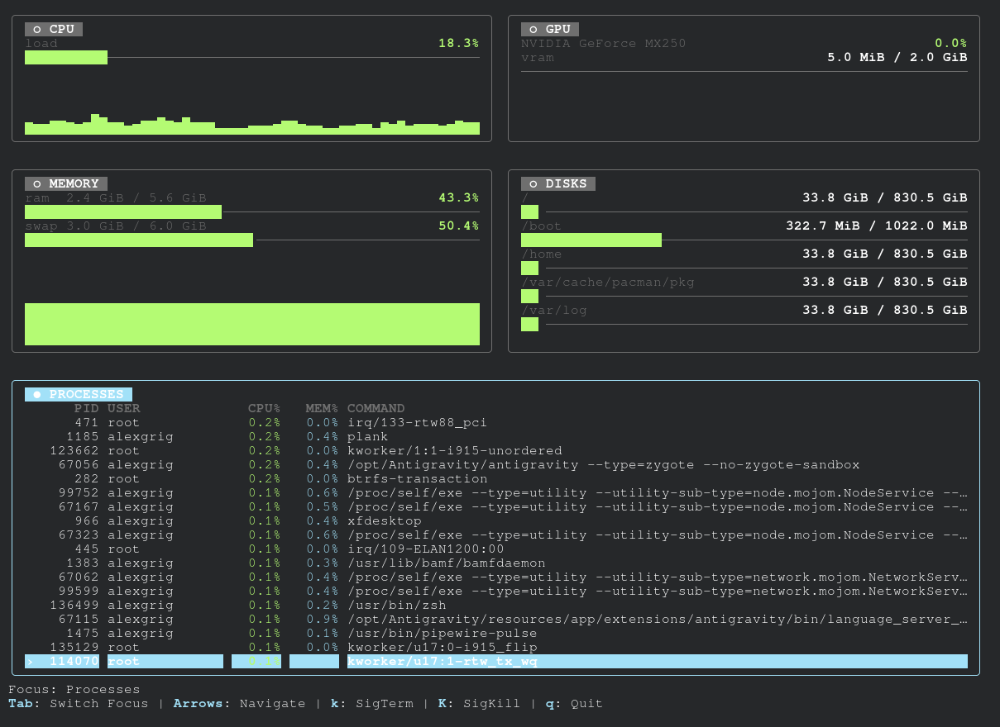

<p align="center">
  
</p>

<h1 align="center">🖥️ QTop</h1>

<p align="center">
  <a href="https://goreportcard.com/report/github.com/QurieGLord/QTop"></a>
  <a href="https://opensource.org/licenses/MIT"></a>
</p>

<p align="center">
  <strong>QTop</strong> is a modern, responsive, and terminal-native system monitor written in Go. Inspired by the aesthetics of <code>btop</code> and the r/CLI community, it provides a clean and focused way to monitor your system resources without the clutter.
</p>

---

## ✨ Features

- 📊 **Real-time Monitoring:** CPU, GPU (Nvidia & AMD), Memory, ZRAM, Swap, and Disks.
- 🎨 **Terminal-Native:** Respects your terminal's color scheme (no hardcoded HEX codes).
- 📱 **Responsive UI:** Adapts layout (Wide/Narrow/Compact) based on window size.
- ⚙️ **Process Management:** Navigate processes with your keyboard and manage them with shortcuts.
- 📦 **Multi-Distro Packaging:** Built-in scripts for Arch, Debian, and RPM packaging.
- 🖱️ **Mouse Support:** Navigate through panels with clicks and scrolls.

---

## 🚀 Getting Started

### Prerequisites
To build QTop from source, you need **Go 1.21** or higher installed on your system.

### Dependency Resolution
Select your distribution below to see the required commands:

<details>
<summary><b>Arch Linux (pacman / AUR)</b></summary>

**Option 1: Official AUR (Recommended)**
```bash
yay -S qtop
```

**Option 2: Manual build**
```bash
sudo pacman -S go base-devel
```
</details>

<details>
<summary><b>Debian / Ubuntu (apt)</b></summary>

```bash
sudo apt update
sudo apt install golang build-essential dpkg
```
</details>

<details>
<summary><b>Fedora / RHEL (dnf)</b></summary>

```bash
sudo dnf install golang rpm-build binutils
```
</details>

---

## 🛠️ Build & Installation

QTop comes with a professional management script `qtop.sh` to handle everything.

| Flag | Description |
| :--- | :--- |
| `-s` | **Build from source** (produces a single binary) |
| `-a` | **Build Arch Linux package** (.pkg.tar.zst) |
| `-d` | **Build Debian package** (.deb) |
| `-r` | **Build RPM package** (.rpm) |
| `-i` | **Install** the built package(s) into the system (requires sudo) |

### Quick Install (Arch Linux example)
```bash
git clone https://github.com/QurieGLord/QTop.git
cd QTop
./qtop.sh -a -i
```

---

## ⌨️ Shortcuts

| Key | Action |
| :--- | :--- |
| `Tab` | Switch focus between panels |
| `Arrows / j,k` | Navigate through process list |
| `k` | **SIGTERM** (Soft kill) selected process |
| `K (Shift+K)` | **SIGKILL** (Force kill) selected process |
| `q / Esc` | Quit QTop |

---

## 📄 License

Distributed under the **MIT License**. See `LICENSE` for more information.

---

<p align="center">
  Made with ❤️ for the CLI community
</p>
